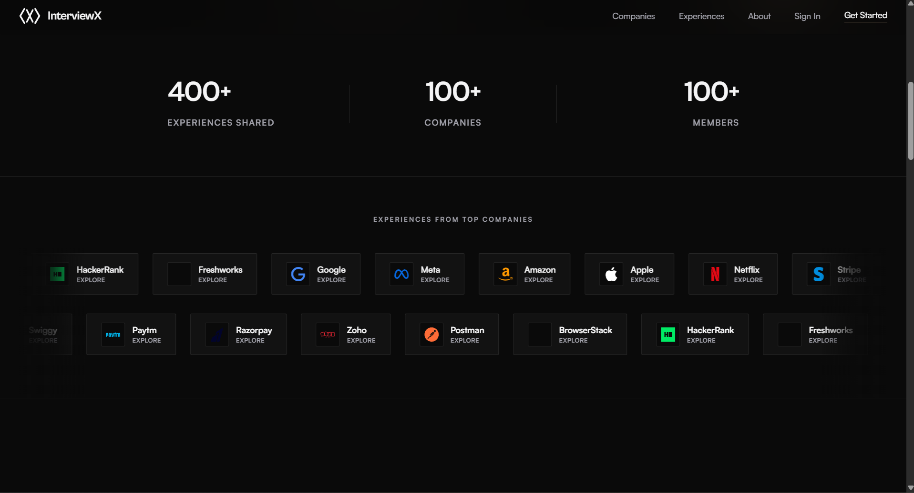
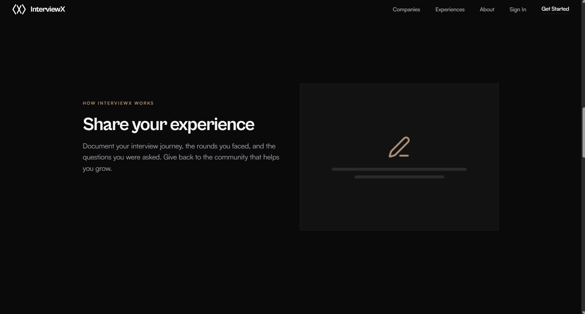
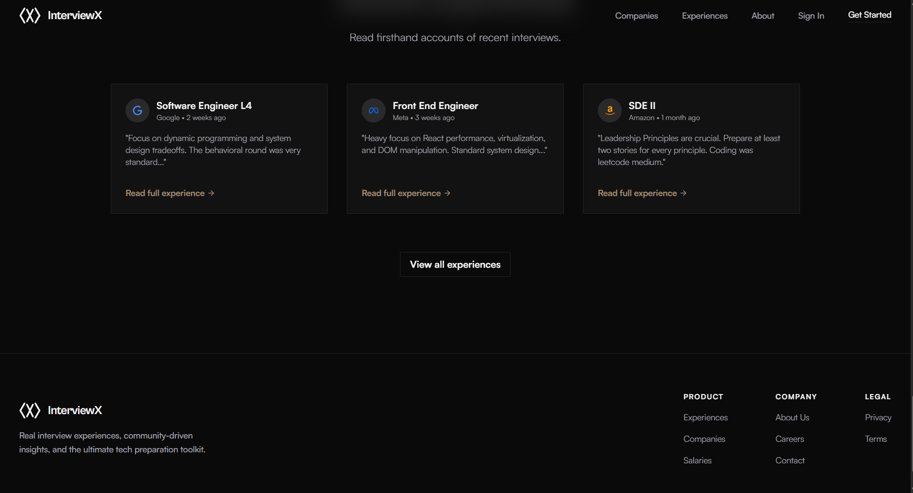
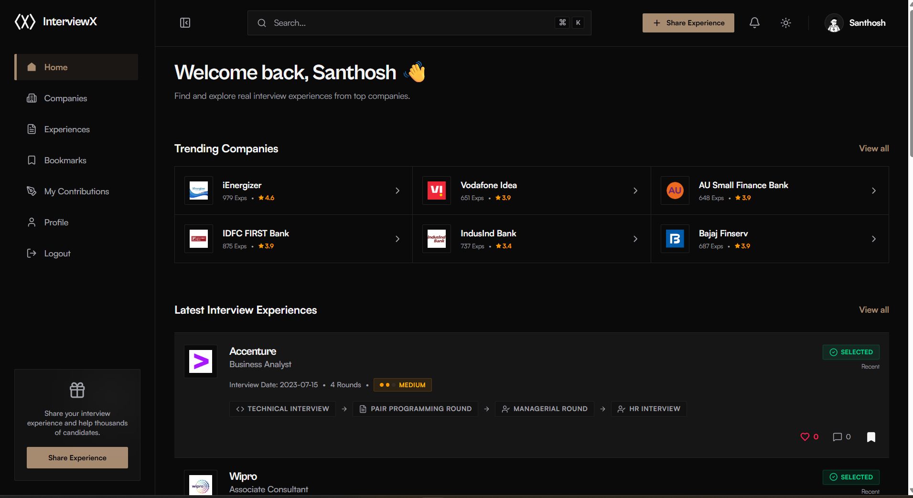
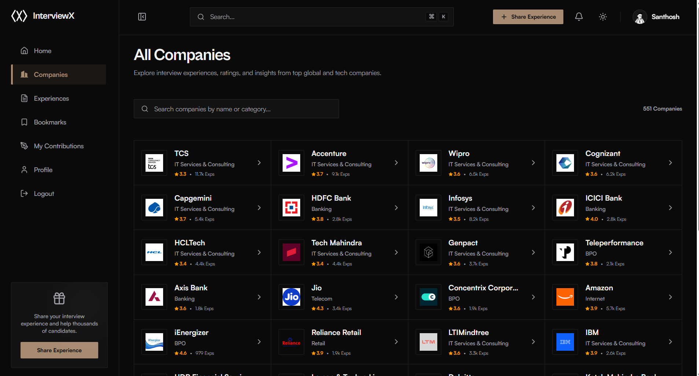
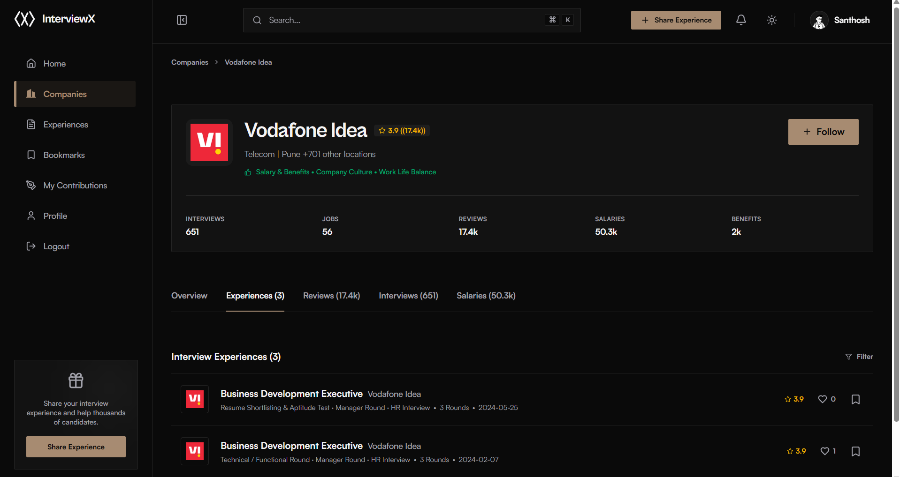
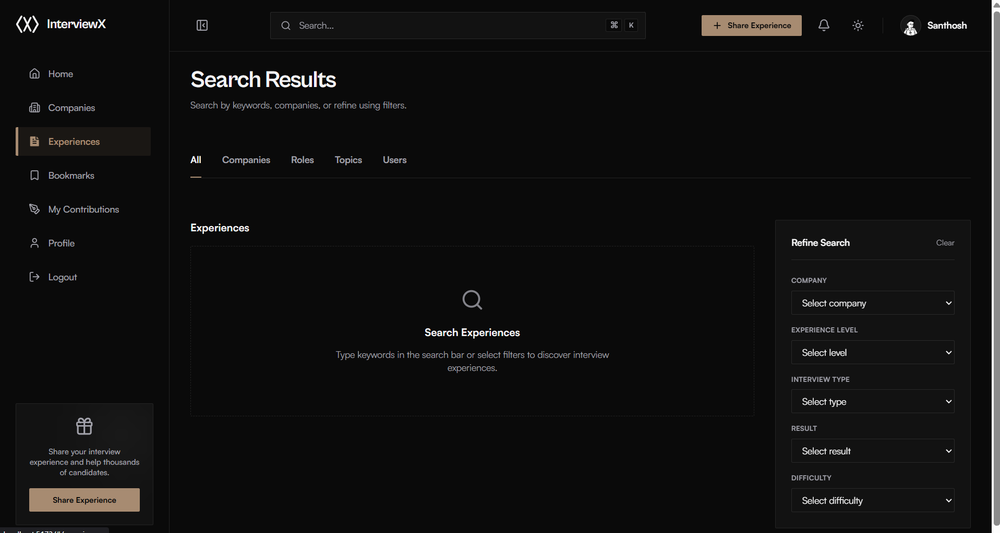
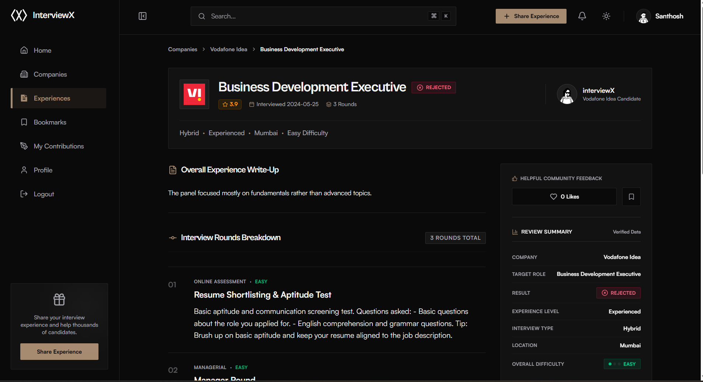
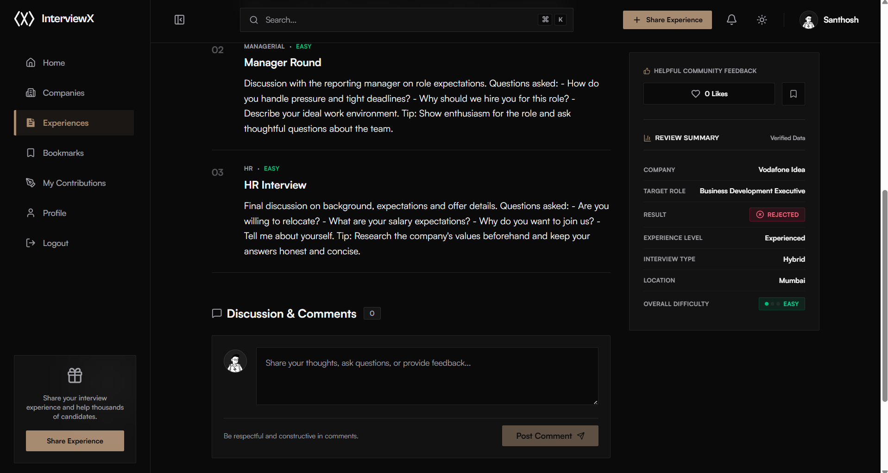

# InterviewX

**InterviewX** is a full-stack interview-experience-sharing platform — think Glassdoor, but structured. Candidates can search companies, read real interview experiences broken down round-by-round (OA, Technical, HR, etc.), and contribute their own to help others prepare.

**🔗 Live App:** [interview-x-rosy.vercel.app](https://interview-x-rosy.vercel.app/)
**⚙️ Backend API:** Hosted on Railway

---

## 📖 Table of Contents

- [Overview](#-overview)
- [Features](#-features)
- [Tech Stack](#-tech-stack)
- [Architecture](#-architecture)
- [Project Structure](#-project-structure)
- [Getting Started](#-getting-started)
  - [Prerequisites](#prerequisites)
  - [Backend Setup](#backend-setup)
  - [Frontend Setup](#frontend-setup)
- [Environment Variables](#-environment-variables)
- [API Overview](#-api-overview)
- [Deployment](#-deployment)
- [Roadmap](#-roadmap)
- [Contributing](#-contributing)
- [License](#-license)

---

## 🧭 Overview

Most interview preparation content is fragmented across blogs, forums, and word-of-mouth, with no consistent structure. InterviewX centralizes this into a searchable, comparable knowledge base — tied to verified user accounts rather than anonymous posts — so you can see rounds, difficulty, questions asked, and outcome, all in one place, for any company and role.

## ✨ Features

- 🔐 **Secure Authentication** — JWT-based sessions with OTP email verification on registration
- 🏢 **Company Directory** — searchable, paginated list of companies with ratings and experience counts
- 📝 **Structured Interview Experiences** — full CRUD, broken into individual rounds (questions, answers, difficulty, tips)
- ❤️ **Likes** — like/unlike experiences, with duplicate and self-like prevention enforced at the database level
- 🔔 **Follow System** — follow companies to get notified when new experiences are posted
- 🔁 **Async Notifications** — notification fan-out runs off the main request thread so core actions stay fast
- 🛡️ **Rate Limiting** — Bucket4j token-bucket limiting on auth endpoints to block brute-force/spam abuse
- ⚠️ **Centralized Error Handling** — consistent, safe error responses across every endpoint
- 👤 **Profile Management** — profile completion tracking, public vs. private profile views

## 📸 Screenshots

### Landing Page

*Hero section — discover and share real interview experiences.*


*400+ experiences shared, 100+ companies, and experiences from top companies like Google, Meta, Amazon, and more.*


*Simple flow — document your interview journey and give back to the community.*


*Preview of recently shared interview experiences on the homepage.*

### Dashboard

*Logged-in home — trending companies and the latest interview experiences at a glance.*

### Companies

*Browse 550+ companies with ratings, categories, and experience counts.*


*Company profile with ratings, interview stats, and a list of shared interview experiences.*

### Experiences

*Search and filter experiences by company, role, interview type, result, and difficulty.*


*Full experience write-up with a round-by-round breakdown, result, and difficulty.*


*Detailed round questions/tips, plus a discussion section for community comments.*

## 🛠 Tech Stack

**Frontend**
| Tech | Purpose |
|---|---|
| React (Vite) | Component-based SPA with fast dev/build tooling |
| Tailwind CSS | Utility-first styling |
| Axios | API calls with JWT interceptors |
| React Router | Client-side routing |

**Backend**
| Tech | Purpose |
|---|---|
| Spring Boot | REST API framework |
| Spring Security | JWT-based auth & filter chain |
| MongoDB (Spring Data) | Document database |
| Bucket4j | Rate limiting on auth endpoints |
| JavaMailSender | OTP email delivery |
| Maven | Build & dependency management |

**Deployment**
| Layer | Platform |
|---|---|
| Frontend | [Vercel](https://vercel.com) |
| Backend | [Railway](https://railway.app) |
| Database | MongoDB Atlas |

## 🏗 Architecture

```
React SPA (Vercel)  ──HTTPS/JSON──▶  Spring Boot API (Railway)
                                            │
                                    Security Filter (JWT)
                                            │
                                        Controller
                                            │
                                          Service
                                            │
                                        Repository
                                            │
                                     MongoDB Atlas
```

Feature-first backend structure: `auth`, `security`, `company`, `experience`, `notification`, `profile`, `common`, `config`, `dto` — each module follows Controller → Service → Repository.

## 📁 Project Structure

```
interviewx/
├── frontend/                 # React + Vite app
│   ├── src/
│   │   ├── components/
│   │   ├── pages/
│   │   ├── context/
│   │   └── api/
│   └── package.json
│
└── backend/                  # Spring Boot app
    └── src/main/java/com/interviewx/
        ├── auth/
        ├── security/
        ├── company/
        ├── experience/
        ├── notification/
        ├── profile/
        ├── common/
        ├── config/
        └── dto/
```

## 🚀 Getting Started

### Prerequisites

- Node.js ≥ 18
- Java 17+
- Maven
- MongoDB (local or Atlas connection string)

### Backend Setup

```bash
cd backend
```

Create `src/main/resources/application.properties` (or set as env vars — see [Environment Variables](#-environment-variables)):

```properties
spring.data.mongodb.uri=your_mongodb_connection_string
jwt.secret=your_jwt_secret
spring.mail.username=your_email
spring.mail.password=your_app_password
```

Run it:

```bash
mvn spring-boot:run
```

The API will start on `http://localhost:8080` by default.

### Frontend Setup

```bash
cd frontend
npm install
```

Create a `.env` file:

```env
VITE_API_BASE_URL=http://localhost:8080/api
```

Run it:

```bash
npm run dev
```

The app will be available at `http://localhost:5173`.

## 🔑 Environment Variables

**Backend (Railway)**
| Variable | Description |
|---|---|
| `SPRING_DATA_MONGODB_URI` | MongoDB Atlas connection string |
| `JWT_SECRET` | Secret key for signing JWTs |
| `SPRING_MAIL_USERNAME` | SMTP username for sending OTP emails |
| `SPRING_MAIL_PASSWORD` | SMTP app password |
| `PORT` | Provided automatically by Railway |

**Frontend (Vercel)**
| Variable | Description |
|---|---|
| `VITE_API_BASE_URL` | Base URL of the deployed backend API |

## 📡 API Overview

| Method | Endpoint | Auth | Description |
|---|---|---|---|
| POST | `/api/auth/send-otp` | No | Send OTP to email |
| POST | `/api/auth/verify-otp` | No | Verify OTP |
| POST | `/api/auth/register` | No | Complete registration |
| POST | `/api/auth/login` | No | Login, returns JWT |
| GET | `/api/companies` | No | Paginated company list/search |
| GET | `/api/companies/{id}` | No | Company detail + experiences |
| POST | `/api/experiences` | Yes | Create an experience |
| GET | `/api/experiences` | No | Paginated, filterable list |
| GET | `/api/experiences/{id}` | No | Single experience with rounds |
| PUT/DELETE | `/api/experiences/{id}` | Owner | Update/delete an experience |
| POST/DELETE | `/api/experiences/{id}/like` | Yes | Like/unlike an experience |
| POST/DELETE | `/api/companies/{id}/follow` | Yes | Follow/unfollow a company |
| GET | `/api/notifications` | Yes | Get notifications |
| GET/PUT | `/api/profile/me` | Yes | View/update own profile |

## 🌐 Deployment

- **Frontend** is deployed on **Vercel**: [interview-x-rosy.vercel.app](https://interview-x-rosy.vercel.app/)
- **Backend** is deployed on **Railway**, exposing a public HTTPS domain via Railway's Networking settings
- Make sure `VITE_API_BASE_URL` on Vercel points to the live Railway backend URL, and that CORS on the backend allows the Vercel domain

## 🗺 Roadmap

- [ ] Redis caching for hot reads
- [ ] Elasticsearch for fuzzy/typo-tolerant search
- [ ] Kafka-based notification fan-out at scale
- [ ] WebSocket-based real-time notifications
- [ ] AI-assisted interview experience tagging

## 🤝 Contributing

Contributions are welcome! Please open an issue first to discuss what you'd like to change, then submit a PR.

1. Fork the repo
2. Create your feature branch (`git checkout -b feature/amazing-feature`)
3. Commit your changes (`git commit -m 'Add amazing feature'`)
4. Push to the branch (`git push origin feature/amazing-feature`)
5. Open a Pull Request

## 📄 License

This project is licensed under the MIT License — see the `LICENSE` file for details.
